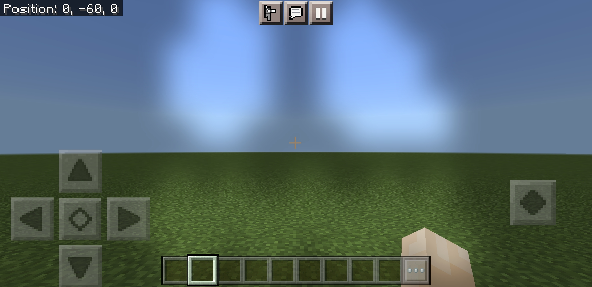

# Transparent Pumpkin

Wearing a carved pumpkin on your head makes endermen not react aggressive as soon as you look them in the eyes. This might
be useful when entering the End, so that a mass of endermen will not attack you. Or maybe you just wear it because it looks
cool which is especially the case for horror maps or Halloween. However wearing a pumpkin comes with one downside: You can
barely see anything in the first person view. This add-on fixes this issue by making the pumpkin screen transparent. You
are able to set the opacity to 0%, 20%, 40%, 60%, 80% or 100% (100% = opaque = vanilla). Most resource packs completely
disable the pumpkin blur on the skin however it might be a better choice to keep it slightly visible so you cannot forget
that you are wearing one.

## Installation

You can install this add-on on [GitHub](https://github.com/phoenixr-codes/transparent-pumpkin/) or on
[MCPEDL]().

## About this Project

The source code of this project is publicly available on the
[GitHub Repository](https://github.com/phoenixr-codes/transparent-pumpkin/).
If you want to share this work please refer to the
[License](https://github.com/phoenixr-codes/transparent-pumpkin/blob/main/LICENSE).

## TODO

* add better description with links etc
* add banner

